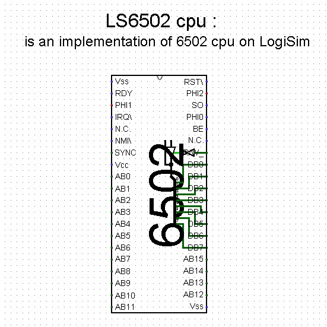
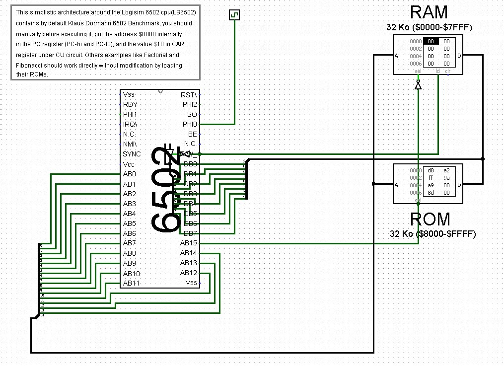
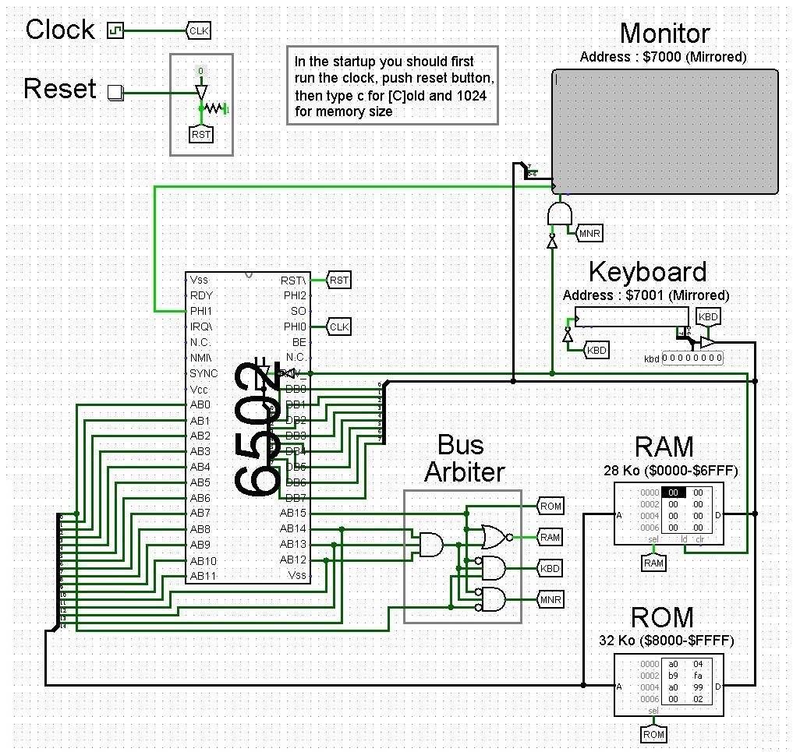

## What is LS 6502 ?

The LS 6502 project is a realization of the very famous [MOS 6502](https://en.wikipedia.org/wiki/MOS_Technology_6502) processor on the [Logisim](http://www.cburch.com/logisim/) logic simulator. 
This processor, being famous, marked the era of computers and game consoles in the 80s. 
As an example, the [Apple II](https://en.wikipedia.org/wiki/Apple_II), [Commodore 64](https://en.wikipedia.org/wiki/Commodore_64), and [BBC Micro computers](https://en.wikipedia.org/wiki/BBC_Micro) were all based on 6502 processors. 
Many very popular game consoles also used this processor, such as the [Atari 2600](https://en.wikipedia.org/wiki/Atari_2600), [Nintendo Entertainment System](https://en.wikipedia.org/wiki/Nintendo_Entertainment_System) (NES), and [Atari Lynx](https://en.wikipedia.org/wiki/Atari_Lynx).

## How the LS 6502 whas implemented ?

The implementation was done on the [Logisim](http://www.cburch.com/logisim/) logic simulator (the stand-alone processor image below).
A simulator normally intended for academic use for small projects, and not complete processors. 
Despite this, the simulator normally manages to run this processor, with a fairly high number of elementary components exceeding 2500.
The implementation was a from scratch build, meaning that the pre-built components of the Logisim library were avoided as much as possible,
and that most of the parts were built at low level with only logic gates and flip-flops, except perhaps for memories like RAM and ROM.

## Testing the LS 6502

The internal implementation, or what is called the microarchitecture, does not exactly follow that of the original MOS 6502 processor.
The LS 6502 was implemented differently for the sake of simplicity and logic gate reduction.
Although the microarchitecture is different and smaller, it manages to perfectly simulate the [instruction set](https://en.wikipedia.org/wiki/Instruction_set_architecture) of the MOS 6502 processor.
To ensure that the simulated processor could follow exactly the same instruction execution behavior of a 6502 processor,
the [Klaus Dormann 6502 Benchmark](https://github.com/Klaus2m5/6502_65C02_functional_tests) test was run on the processor, which also allowed several bugs to be found and corrected
(the image below represents the LS 6502 used in a basic architecture for the [benchmark](https://en.wikipedia.org/wiki/Benchmark_(computing)) exercise).
On the other hand, the hardware reduction of the processor caused the timing specifications to be no longer respected.
So the LS 6502 processor does not take the same execution time (in clock cycles) as a real MOS 6502 processor.
Usually the simulated processor requires more time.

## Creating a simple 6502 computer from the 80s era

To test the processor in a real environment, a simplistic architecture similar to that of the computers of the 80s was rebuilt. Using,
as it was known at the time. [BASIC](https://en.wikipedia.org/wiki/BASIC) as operating system and programming language.
[Enhanced BASIC](http://retro.hansotten.nl/6502-sbc/lee-davison-web-site/enhanced-6502-basic/) was integrated into the ROM of the architecture,
which allowed to use as a machine similar to the computers of the 80s on the Logisim simulator.
Although the response time was very very slow (the image below is a capture of this BASIC-based architecture).

